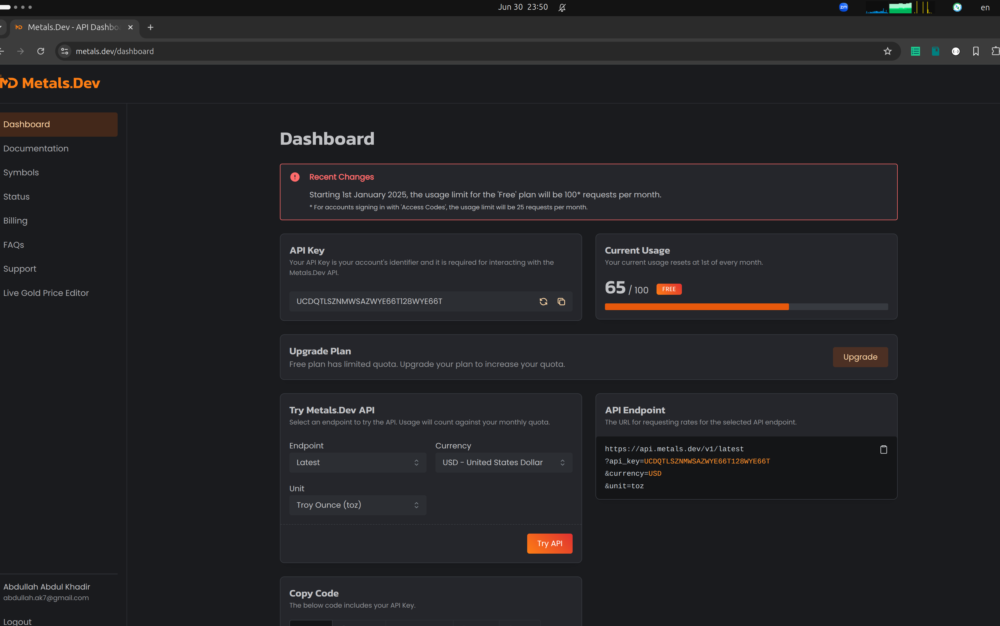
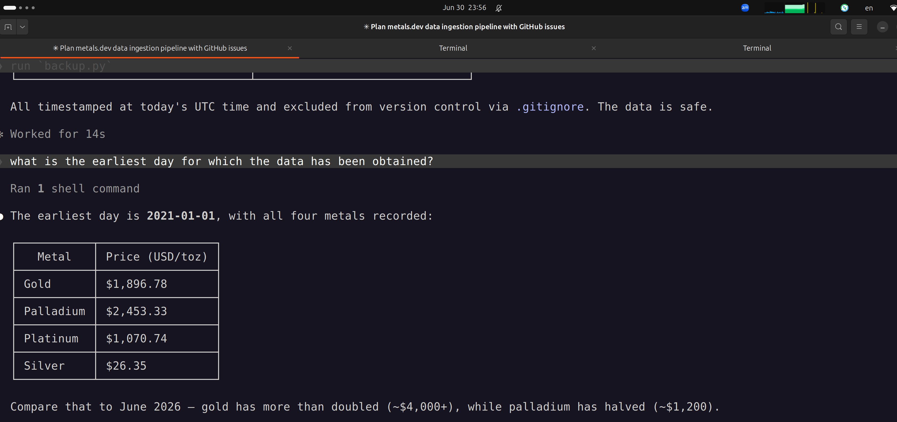
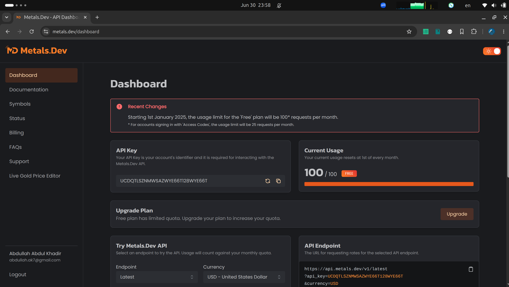

# MetallicTrends

[](https://github.com/abdullah85/metallictrends/releases/tag/v0.3.0)

Precious metals — gold, silver, platinum, and palladium — have shaped economies and driven markets for centuries. MetallicTrends is a platform for exploring how their prices evolve over time: what drives long-term trends, how different metals correlate, and what patterns emerge from years of daily market data. Currently, we use [metals.dev](https://metals.dev/) to build a resilient ingestion layer that collects historical prices for any date range you specify and stores them in a structured local database — the foundation on which analysis, visualisation, and APIs can be built.

## Overview

MetallicTrends retrieves daily price data for any date range you specify using the [metals.dev timeseries](https://www.metals.dev/docs#timeseries-endpoint) API. Because the API returns a maximum of 30 days per request, the tool automatically splits your range into windows, tracks the status of each in the database, and resumes from the last successful point if interrupted, **without** re-fetching data already retrieved. The retrieved data cannot be listed publicly and hence, the project includes a backup utility that produces timestamped copies of the SQLite database and exports price records to CSV for portability.

## Releases

**[v0.1.0](https://github.com/abdullah85/metallictrends/releases/tag/v0.1.0)** — Initial release: the resumable metals.dev ingestion pipeline, SQLite storage, and backup/export tooling described below.

## Technical Highlights

- **Resumable backfill** — checkpoint state and price data share the same SQLite file, so a crash cannot leave them out of sync. Re-running the script picks up exactly where it left off.
- **Minimal API usage** — all four metals are returned in a single request per window. The tool makes only as many requests as your date range requires, keeping usage within the free tier where possible.
- **Tested without live requests** — the unit test suite uses `unittest.mock` to intercept HTTP calls and replay a recorded API response, so no API quota is consumed during testing.
- **Deliberate simplicity** — currently built on `requests`, `sqlite3`, and `python-dotenv`. No ORM, no framework, no async. Easy to read, easy to extend.

## Prerequisites

- Python 3.12+
- A [metals.dev](https://metals.dev) account with a valid API key (free tier: 100 requests/month)

## Setup

1. Clone the repository and navigate into it:

   ```bash
   git clone https://github.com/abdullah85/metallictrends.git
   cd metallictrends
   ```

2. Create and activate a virtual environment:

   ```bash
   python -m venv .venv
   source .venv/bin/activate
   ```

3. Install dependencies:

   ```bash
   pip install -e ".[dev]"
   ```

4. Copy the environment template and add your API key:

   ```bash
   cp .env.example .env
   ```

   Open `.env` and replace `your_api_key_here` with your metals.dev API key.

## Usage

### Run the extraction

Fetches daily prices for your specified date range and saves results to `metals.db`:

```bash
metallictrends-backfill --start-date 2021-01-01 --end-date 2026-01-01
```

The script is safe to re-run. Completed windows are skipped; failed windows are retried.

### Back up the data

Copies `metals.db` to a timestamped file and exports price records to CSV:

```bash
metallictrends-backup
```

Output is written to the `data/` directory, which is excluded from version control.

### Run the tests

```bash
pytest
```

No API key required. All HTTP calls are intercepted by `unittest.mock`.

## Project Structure

```
metallictrends/
├── src/metallictrends/
│   ├── db.py                   # SQLite schema, record insertion, and window status updates
│   ├── ingestion/
│   │   ├── client.py           # Calls the metals.dev timeseries endpoint for a given date window
│   │   ├── run.py              # Backfill orchestrator — entry point: metallictrends-backfill
│   │   └── backup.py           # Timestamped database backup and CSV export — entry point: metallictrends-backup
│   ├── sync/
│   │   └── github.py           # Commits metals.db to GitHub so it survives Render's ephemeral disk
│   └── api/
│       └── app.py              # FastAPI app: landing page + /api/* routes — served as metallictrends.api.app:app
├── web/                        # Static landing page (HTML/CSS/JS), served by api/app.py's StaticFiles mount
├── tests/                      # Mirrors src/metallictrends/'s layout
│   ├── conftest.py             # Shared pytest fixtures available to all test files automatically
│   ├── test_db.py
│   ├── ingestion/
│   │   ├── test_client.py
│   │   └── test_run.py
│   └── api/
│       └── test_app.py
├── data/                       # Git-ignored — stores .db backups and CSV exports
├── media/                      # Screenshots documenting the backfill session
├── .env.example                # API key template
└── pyproject.toml              # Project metadata, dependencies, and CLI entry points
```

## Data Storage

Price records are stored in `metals.db`, a local SQLite database with three tables:

- `metal_prices` — one row per metal per day (`date`, `metal`, `price_usd`), covering gold, palladium, platinum, and silver in USD per troy ounce
- `fx_rates` — one row per currency per day (`date`, `currency`, `rate_to_usd`), covering 12 currencies returned by the API. Joining `metal_prices` with `fx_rates` on `date` gives the price of any metal in any currency.
- `backfill_windows` — one row per 30-day window tracking fetch status (`pending`, `fetched`, or `failed`)

`metals.db` is excluded from version control.

Use `python backup.py` to create a safe copy after each successful run.

## In Action

The screenshots below document a real backfill session against the metals.dev free tier (100 requests/month).

**After the first run (June 2026) — 65 of 100 requests used:**



**Data confirmation — earliest record at 2021-01-01:**



**After extending the backfill to 2018-02-01 — quota fully consumed:**



**Checkout sample snapshot of values for the first 15 days shown below:**

```
$ sqlite3 metals.db < queries/daily_prices_pivot.sql
date          gold_usd      palladium     platinum      silver      gold_inr        gold_eur      gold_jpy      gold_cny
------------  ------------  ------------  ------------  ----------  --------------  ------------  ------------  ------------
2018-02-01    $1348.29      $1039.21      $1005.89      $17.21      ₹86218.85       €1077.69      ¥147499.22    ¥8488.41
2018-02-02    $1333.12      $1047.48      $988.78       $16.60      ₹85522.20       €1069.87      ¥146754.73    ¥8404.70
2018-02-03    $1333.21      $1047.95      $991.58       $16.61      ₹85522.41       €1069.71      ¥146748.37    ¥8400.76
2018-02-04    $1333.03      $1047.27      $989.99       $16.64      ₹85489.08       €1070.78      ¥146696.51    ¥8403.51
2018-02-05    $1339.53      $1027.54      $990.19       $16.76      ₹85988.63       €1083.08      ¥146093.46    ¥8433.16
2018-02-06    $1324.94      $1012.22      $991.05       $16.66      ₹85024.83       €1070.22      ¥145215.04    ¥8323.86
2018-02-07    $1318.86      $986.84       $980.64       $16.40      ₹84770.60       €1075.01      ¥144043.36    ¥8287.84
2018-02-08    $1321.23      $964.48       $972.55       $16.44      ₹85087.00       €1077.98      ¥143487.28    ¥8372.82
2018-02-09    $1316.29      $976.91       $964.75       $16.35      ₹84648.98       €1074.76      ¥143199.71    ¥8292.38
2018-02-10    $1316.15      $977.81       $964.99       $16.35      ₹84601.99       €1074.27      ¥143184.63    ¥8282.02
2018-02-11    $1316.08      $983.99       $967.99       $16.37      ₹84619.30       €1074.17      ¥143192.68    ¥8281.79
2018-02-12    $1322.72      $985.73       $970.94       $16.55      ₹85018.40       €1075.43      ¥143757.89    ¥8366.12
2018-02-13    $1330.97      $987.57       $974.96       $16.59      ₹85527.12       €1077.37      ¥143454.74    ¥8434.34
2018-02-14    $1352.59      $1002.61      $997.85       $16.89      ₹86665.87       €1085.31      ¥144338.31    ¥8567.23
2018-02-15    $1353.45      $1018.95      $1001.28      $16.87      ₹86477.20       €1082.31      ¥143617.86    ¥8559.99
```

Thus, we were able to successfully ingest data from metals.dev and make good use of the free quota provided.
